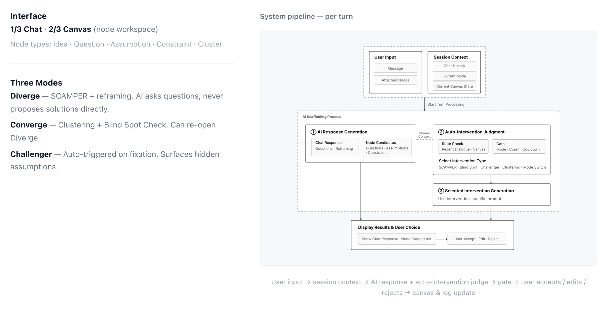
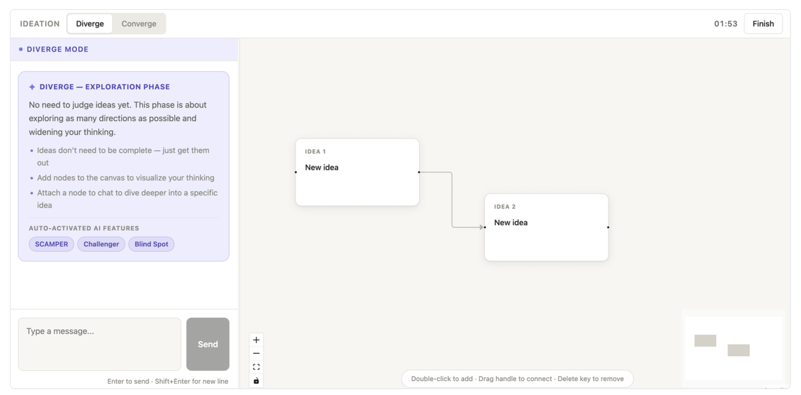
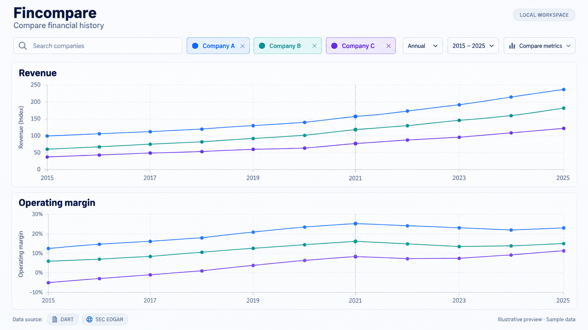
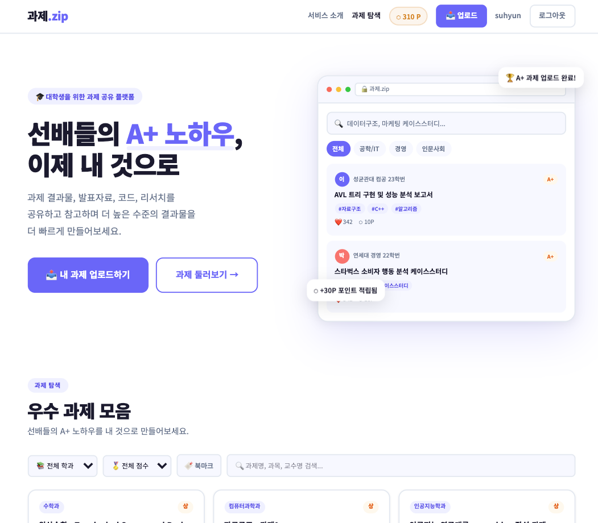
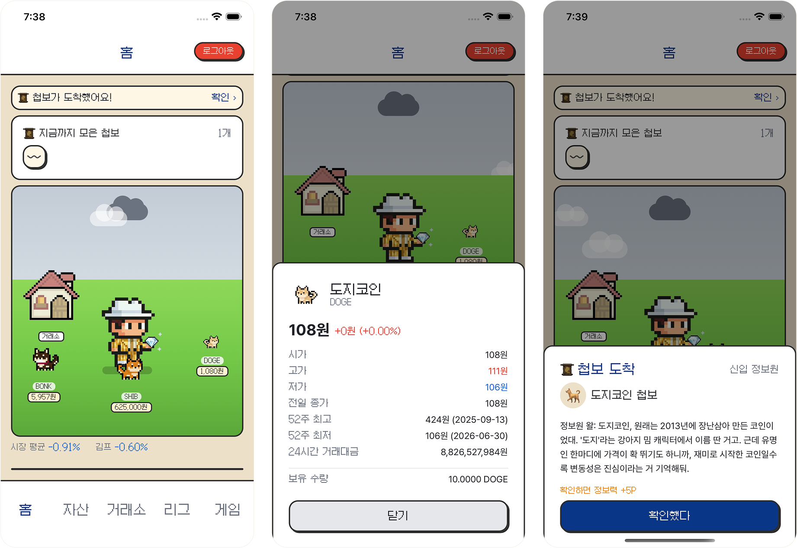
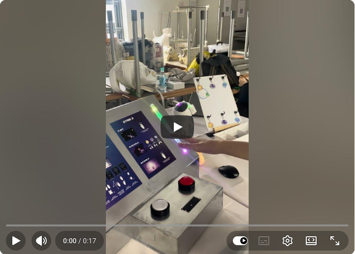

# Hi, I'm Suhyun Kim (Siena) 👋

I study Computer Science and Integrated Design at Yonsei University. I build web and mobile applications, with an interest in AI, accessibility, and how people use technology.

I enjoy working across design and development—from figuring out what would be useful to building a working prototype.

[LinkedIn](https://www.linkedin.com/in/suhyun-kim-yonsei/) · [Email](mailto:ksuhyun0503@yonsei.ac.kr)

## Selected Projects

### [AI-Scaffolded Ideation](https://github.com/hi-suhyun/ai-scaffolded-ideation)

  
  

An AI brainstorming tool that guides users through exploring, clustering, and refining ideas. I built the client and backend integration, including the multistep LLM workflow and streaming responses.

**React · TypeScript · Python · FastAPI**

### [Fincompare](https://github.com/hi-suhyun/fincompare)

Illustrative preview · Sample data

A local tool for comparing Korean and U.S. companies' financial history using DART and SEC filings. It brings metrics into synchronized charts, with calculation details and explanations for missing data.

**TypeScript · React · Express · SQLite · Recharts**

### [gwaje.zip](https://github.com/hi-suhyun/gwaje.zip)

A university assignment-sharing platform built as a solo term project. Includes authentication, file uploads, administrator review, and a points-based download system.

**Next.js · TypeScript · Supabase · PostgreSQL**

### [Coin Village](https://github.com/hi-suhyun/CoinVillage)

An educational mobile game for practicing investing with virtual coins and a play-money wallet. I worked on the mobile app, using Decimal.js for balance calculations and Jest for calculation and reward logic.

**React Native · Expo · Decimal.js · Jest**

### Mindcraft

A cognitive remediation game that combines hand tracking and EEG-based interaction.

▶ **[Watch the Mindcraft demo](https://youtube.com/shorts/IFcvsIzf1S4?is=MN8VGr5E8T-lYYL0)**

## Accessibility & Research

I also lead **Handseq**, a webcam-based activity prototype for children with autism, connecting Python hand tracking to Unity. My research work includes building the speech pipeline for a [CHI 2026 study on voice-based agents for accessible online shopping](https://dl.acm.org/doi/10.1145/3772318.3791681).
